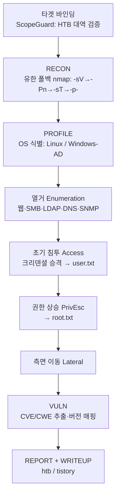
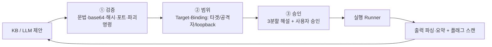

# htb-agent 아키텍처

HTB 머신 승인제 자동 풀이 에이전트의 구조·흐름·안전 모델을 한 곳에 정리한 문서.
(이전의 조각난 ROADMAP 을 대체하는 단일 기준 문서)

---

## 1. 한눈에 보기

- **목적**: 권한이 확인된 HTB 머신을 모의해킹 **표준 단계 순서**로 풀이 보조.
- **원칙**: 승인제(사람이 실행 승인) · 외부 라이트업 미참조(사용자 자료만) ·
  무한루프 금지(유한 상한) · 증거기반 판단(〔확인〕/〔추정〕).
- **실행 환경**: Kali/Ubuntu + HTB VPN (개발·테스트는 어디서나, 표준 라이브러리만).

---

## 2. 진행 파이프라인 (모의해킹 단계 순서)



각 단계는 **해당 phase 의 KB 규칙 + LLM(단계 힌트) 적응 라운드**를 돌리고,
이전 관측을 다음 제안에 반영한다. 전역 상한(`max_enum`·`max_llm`) + 라운드
상한(`max_rounds`) + "새 명령 없으면 조기 종료"로 **반드시 유한**하다.

---

## 3. 실행 전 3관문 (모든 명령 공통)



LLM 이 제안한 명령도 '신뢰하지 않는 데이터'로 간주되어 이 3관문을 반드시 통과한다.

---

## 4. 모듈 지도

| 영역 | 모듈 | 역할 |
|---|---|---|
| **안전** | `scope_guard.py` | Target-Binding, 범위밖 기본거부 |
| | `command_validator.py` | 문법·base64·16/10진수·포트·해시·파괴명령 |
| | `approval.py` | 승인 게이트 + 바이너리/옵션/파라미터 3분할 해설 |
| **관측** | `observation/parsers.py` | nmap(XML/텍스트)·HTTP 파싱 |
| | `observation/web.py` | gobuster·ffuf·feroxbuster·nikto·whatweb |
| | `observation/smb.py` | smbclient·smbmap·netexec |
| | `observation/ad.py` · `net.py` | ldapsearch · dig·snmpwalk |
| | `observation/summarize.py` · `compressor.py` | 도구별 요약 라우팅 · 토큰 절감 |
| **식별** | `target_profiler.py` | Linux vs Windows-AD, 증거기반 확신도 |
| **지능** | `knowledge.py` + `knowledge/` | 단계별 규칙·노트·취약점(사용자 학습으로 성장) |
| | `orchestrator.py` | 단계 순서 상태머신(유한) |
| | `llm/` | Claude/Ollama 프로바이더 + 티어링 + 캐싱·비용 |
| **실행** | `tools/runner.py` | Subprocess(실제) / Fake(테스트) |
| | `tools/recon.py` | 유한 폴백 포트스캔 |
| | `tools/registry.py` + `scripts/install_tools.sh` | 도구 목록·가용성 + 일괄 설치 |
| **목표** | `vuln.py` + `knowledge/vulns/` | CVE/CWE 탐지·매핑 |
| | `flag.py` | user.txt/root.txt 탐지·분류 |
| **운영** | `state.py` | 세션 상태 영속(중단/재개) |
| | `creds.py` | 크리덴셜 볼트(수동제안 → 실행 승격) |
| | `audit.py` | 실행 트랜스크립트(JSONL) |
| | `config.py` | 설정 파일(JSON/YAML, CLI>config>기본) |
| | `environment.py` · `main.py` | Kali 프리플라이트 · CLI 진입점 |
| | `writeup.py` | 라이트업 생성(htb-ctf-writeup-v5 / Tistory 13섹션) |

---

## 5. 데이터·성장·운영 저장소

- **학습데이터(성장)**: `knowledge/rules/*.json`(단계별 액션) · `notes/*.md`(노하우) ·
  `vulns/*.json`(버전→CVE). 파일을 추가할수록 제안이 풍부해진다. 외부 검색 없음.
- **세션 상태**: `state/<타겟>.json` — 포트·OS·발견·크리덴셜·플래그·이력 (중단/재개).
- **감사 로그**: `state/audit_<타겟>.jsonl` — 모든 제안·검증·승인·실행·플래그.
- (모두 `.gitignore` 처리 — 로컬·민감정보)

---

## 6. 사용법 요약

```bash
cd htb-agent
sudo ./scripts/install_tools.sh                 # Kali 보안 도구 일괄 설치
pip install -e .                                # 에이전트 설치 → 'htb-agent' 명령
htb-agent 10.129.1.5                            # 승인제 풀이
htb-agent 10.129.1.5 --auto \
  --cred administrator:Passw0rd \               # 자격증명 → access/flag 승격
  --llm claude --writeup                        # LLM 두뇌 + 라이트업 생성
htb-agent 10.129.1.5 --resume                   # 중단 지점 재개
```

전체 옵션은 `htb-agent --help`. 설치 없이 쓰려면 `PYTHONPATH=src python3 -m htb_agent ...`.

---

## 7. 테스트

```bash
cd htb-agent && python3 tests/run_all.py        # 22 스위트 359 테스트
```

네트워크·도구 없이도 **러너 주입**으로 전 로직 검증하며, 통합 테스트는 `main()` 을
엔드투엔드 구동한다. CI(GitHub Actions)가 push/PR 마다 테스트+컴파일(게이트)과
ruff/mypy(비차단)를 수행한다.

---

## 8. 한계 (과장 금지)

- 명령 검증은 **형식적 무오류 + 실행 가능 형태**까지 보장. 도구별 옵션 의미,
  해시의 정답 여부(평문 없이 불가)는 미보장.
- OS/취약점 판정은 **증거기반 확신도** — 약하면 `〔추정〕` 표기.
- LLM 비용은 **추정치**(pricing). 정확한 청구는 콘솔 확인.
- 실제 공격 실행·VPN 은 사용자 Kali 환경 전용.
